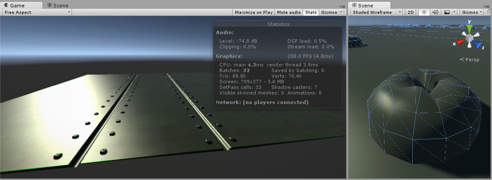
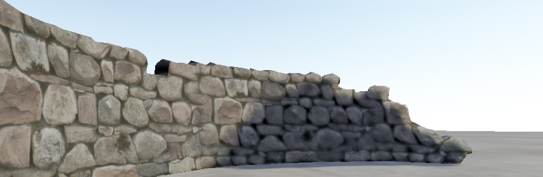

# 法线贴图

我们知道，一般情况下，模型面数越高，可以表现的细节越多，效果也越好。但是，由于面数多了，顶点多了，计算量就大了。为了解决该问题就出现了凹凸映射。 凹凸映射就是通过修改模型表面的法线让模型看起来好像是“凹凸不平”的样子，增加细节层次感，达到高模的效果。但是可以从模型的轮廓边缘处看出“破绽”。

例如，您可能希望显示一个表面，在表面上有凹槽和螺钉或铆钉，比如飞机机身。为实现此目的，一种方法是将这些细节建模为几何体。

根据具体情况，将这些微小的细节建模为“真实”几何体通常并非一种好的思路, 微小的细节需要太多的三角形， 然而对于整个场景来说又微不足道，这种情况我们应该使用法线贴图来表示精确的表面细节。

法线贴图只改变关照效果，而不会改变具体模型形状。

## 存储法线

通常纹理只会储存 RGB 信息, rgb 信息的取值范围是\[0,1\].

而法线的取值范围是[-1, 1],所以存储法线的话，需要将法线乘 0.5 然后再加上 0.5,这样的取值区间就会在 RGB 的取值范围了。

> RBG = 法线 \* 0.5 + 0.5

相反，对于需要取到法线结果而言， 需要乘以 2 然后减去 1， 这样就是法线取值范围了

> 法线 = RGB \* 2 - 1

举个例子：

前端拿到了(0.43, 0.91, 0.80)这个纹理值， 那么这个值代表的就是矢量( –0.14, 0.82, 0.6 )，这个值可以直接用于法线

## 实际对比

没有法线贴图的石墙

采用了法线贴图的石墙

# 高度贴图

高度贴图（也称为视差贴图）是与法线贴图类似的概念，但是这种技术更复杂，因此性能成本也更高。高度贴图往往与法线贴图结合使用，通常情况下，当纹理贴图负责渲染表面的大型凸起时，高度贴图用于为表面提供额外的定义。

首先看下效果:

从左往右依次为:

1. 分配了反照率贴图但未分配法线贴图和高度贴图的岩石墙壁材质
2. 分配了法线贴图。表面上的光照经过修改，但岩石不会相互遮挡
3. 分配了法线贴图和高度贴图的最终效果

# Lambert's cosine law 兰伯特余弦定理

**余弦辐射体/朗伯辐射体** 说明的是一种发光强度的空间分布符合余弦定律的物体, 具体来说是为

> 该辐射表面在某个方向上的辐射强度(radiant intensity, I)随该方向和表面法线之间夹角的余弦而变化

朗伯余弦定理并不是一种描述世界万物的发光强度定律，

所以符合这个定律的被称为**余弦辐射体/朗伯辐射体**, 不符合的称为**非朗伯面/各向异性表面**

> Iθ = In COSθ

# Phong 和 Blinn-Phong 模型

资料:

[入门 Shading，详解 Blinn-Phong 和 Phong 光照模型](https://zhuanlan.zhihu.com/p/352209183)

光照模型需要处理三种现实世界的关照类型

- 高光 物体完全反射光源照射到表面的光照到人眼
- 漫反射光 物体朝着任意方向反射相同亮度的光照到人眼
- 环境光 物体表面完全背对光源，但其它物体反射光照照射到该物体表面上，再通过该物体反射光照到人眼

# PBR Physically-Based Rendering

PBR, 全称 Physically-Based Rendering, 意为物理基础渲染, PBR 与其之前的不同之处在很大程度上是对光和表面行为的更详细推理
