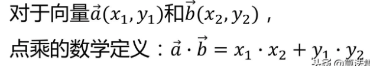
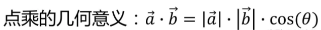
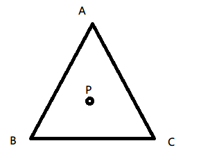
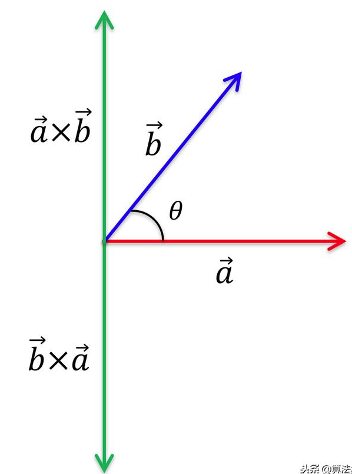
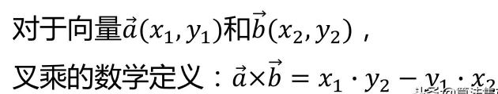
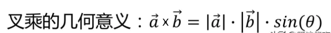
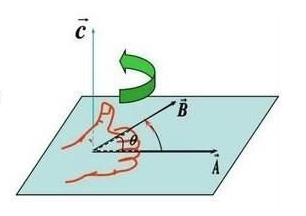
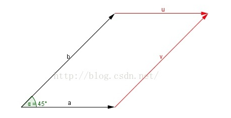

# 三维世界中数学工具收集

- [矩阵可视化](https://harry7557558.github.io/tools/matrixv.html)

# 向量的点乘





由向量的点乘的意义可以看出, 两个单位向量相乘,

1. 如果点乘越接近 1，代表两个向量之间的夹角越小. 等于 1 时两个向量重合
2. 如果点乘越接近 0，代表两个向量之间的夹角越大，等于 0 时两个向量垂直

应用：

1. 判断点是否在内部外部，左侧右侧

   

   如上图判断点 P 是在三角行 ABC 内部还是外部, PA PB PC 分别进行点乘, 向量点乘结果为正数那么夹角为锐角, 为负数则为钝角, 如果点在三角形内部, 那么三组点乘结果中至少有两组结果为负数（ 钝角 ）

   如果存在两组为钝角则在内部， 否则外部

2. 判断两个向量的接近程度

   两个向量点乘结果越接近 1 接近程度越高，这点在光照中有较好应用。假设一个微平面为朗伯平面, 那么平面的反射强度与入射角和平面法线角度的余弦成正比, 所以光照强度则是和 COSθ 相关, 而单位向量点乘就等于 COSθ

3. 投影 求向量 A 在向量 B 上的投影

   两个向量都是单位向量, dot(normalize(a),normalize(b))=COSθ, 投影结果就是 大小: COSθ 乘向量 A 的模 方向: 向量 B 方向

# 向量的叉乘





叉乘的运算结果是一个向量而不是一个标量，上述结果是它的模， 结果向量 C 的方向与 A，B 所在的平面垂直，方向用“右手螺旋法则”判断。判断方法如下：



在二维空间中，叉乘还有另外一个几何意义就是：叉积等于由向量 A 和向量 B 构成的平行四边形的面积。


# 在不支持浮点数纹理的条件下存储纹理数据

论 如何在不支持浮点纹理的条件下储存纹理, 纹理包含四个数据, 如何将数据存储在四个分量上才能不丢失原有数据含义?

## 存

```glsl
vec4 packDepth(float depth) {
    const vec4 bitShift = vec4(1.0, 255.0, 255.0 * 255.0, 255.0 * 255.0 * 255.0);
    const vec4 bitMask = vec4(1.0/255.0, 1.0/255.0, 1.0/255.0, 0.0);
    vec4 rgbaDepth = fract(depth * bitShift);
    rgbaDepth -= rgbaDepth.gbaa * bitMask;
	return rgbaDepth;
}
```