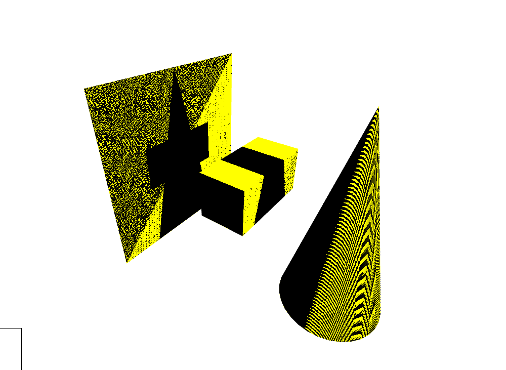
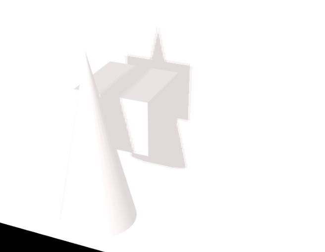

# 三维空间阴影

阴影的产生和处理与光照有异曲同工之妙，光照不到的地方便是阴影。
对于光照模型来说，阴影相当于影响颜色混合的一个部分，完全可以分开运算，最后再混合颜色得到最终效果

## 阴影映射渲染

首先将相机移动到光源位置，观察模型，生成深度贴图。

```js
const frustumSize = 4;
const shadowMapSize = 512;
const postCamera = new THREE.OrthographicCamera(
  -frustumSize / 2,
  frustumSize / 2,
  frustumSize / 2,
  -frustumSize / 2,
  0.5,
  2000
);
postCamera.position.set(0, 0, 10);
postCamera.lookAt(new THREE.Vector3(0, 0, 0));

const target = new THREE.WebGLRenderTarget(width, height);
target.depthTexture = new THREE.DepthTexture(width, height);

camera.setViewOffset(width, height, 0, 0, width, height);

renderer.setRenderTarget(target);
renderer.render(scene, postCamera);

renderer.setRenderTarget(null);
```

`target.depthTexture`将会是我们需要的深度贴图，看起来像是这样:


没错，我们在场景中顺着 Z 轴方向，依次放了一块 Plane, 一个 Cube 和 Cone. 其中颜色越深代表深度值越小，越浅代表深度值越大。记住这个位置，我们称为光源空间。

然后照常渲染模型( 注意相机使用的是原本的相机 ):

```js
renderer.render(scene, camera);
```

最后一步是在着色器中完成的，将原本世界中的点映射到光源空间，与深度贴图光源空间中的深度值做对比，比贴图中的大，说明处于阴影中，反之，处于光照中。

```js
/*language=glsl*/
const vertexShader = `
    varying vec2 aUv;
    varying vec4 aFragPosLightSpace;
    uniform mat4 lightPro;
    uniform mat4 lightView;
    
    varying vec3 aNormal;
    void main () {
      gl_Position = projectionMatrix * viewMatrix * modelMatrix * vec4(position, 1.0);
      aUv = uv;
      vec3 aFragPos = vec3(modelMatrix * vec4(position, 1.0));
      aFragPosLightSpace = lightPro * lightView * vec4(aFragPos, 1.);
      aNormal = normal;
    }
`;
```

`lightPro`是第一步中移动到光源处的相机投影矩阵, 就是**postCamera.projectionMatrix**

`lightView`同样是 postCamera, 为**postCamera.matrixWorldInverse**

```js
/*language=glsl*/
const fragmentShader = `
#include <packing>
uniform sampler2D aDepthMap;
varying vec2 aUv;
varying vec4 aFragPosLightSpace;
varying vec3 aNormal;

void main() {
  vec3 projCoords = aFragPosLightSpace.xyz / aFragPosLightSpace.w;
  projCoords = projCoords * 0.5 + 0.5;

  float depth = texture(aDepthMap, projCoords.xy).r;
  float currentDepth = projCoords.z;

  if (currentDepth < depth) {
    gl_FragColor = vec4(1., 1., 0., 1.);
  } else {
    gl_FragColor = vec4(0., 0., 0., 1.);
  }
}
`;
```

可以看到结果像是这样:


## 阴影瑕疵/失真 解决方案

上图中的非阴影部分就是阴影瑕疵/失真，主要原因是深度贴图的分辨率是有限的，一个像素映射的是一片区域.

让我们转成几何模型来研究这个问题:


我将使用上面的图片来解释为什么会出现阴影失真的问题。

首先黄色的线 L 代表正交相机的近平面，CD 代表接受阴影的平面。我们从单位像素来观察，AB 代表的是深度贴图的单位像素,
深度贴图储存的是深度值(x,y,z),

一个像素只能代表一个深度值，但是一个像素却对应了一片区域！

假设 AB 的深度值代表的是 EF 的距离，可以观察到 CF 上的点到 AB 的距离小于 F 点到 AB 的距离，所以 CF 上的点被光照射

FD 上的点到 AB 的距离大于 F 点到 AB 的距离，所以 FD 上的点会产生阴影！

这就是为什么非阴影区域会产生线条的原因。

解决办法也很暴力，直接往 L 近平面垂直方向移动一定距离，这个距离就是阴影偏移( shadow bias )

画几条辅助线，再看下效果:


我现在需要的是将 FD 上的点往 FE 方向进行偏移, 这样 FD 上的点就不会有阴影了, D 点是偏移最大的点，对 FD 上的点全部使用 D
点的偏移，
这样 FD 上的点肯定不会有阴影了。

设 GF 和 FD 形成的角度为 θ

那么|GD|=tanθ \* |FG|. 那么 θ 是多少呢？

FE 和 N 形成的角度为 θ1, FG 和 N 形成的角度为 θ2, 那么有如下关系:

```
θ1 + θ2 = 90°
θ2 + θ = 90°
```

所以简单推理知道 θ=θ1， 而 EF 和 N 为单位向量, 所以

```
dot(EF,N) = cos(θ)
```

简简单单利用反余弦函数，得出 tanθ 值

```
tanθ = tan(acos(dot, EF, N));
```

那么 FG 的大小怎么表示呢？首先上面的 ABCD 区域都是我们假设的单位像素区域, 所以|AB|就是**frustumSize/shadowMapSize**, 自然
FG 就是他的一半了。

着色器代码如下所示:

```glsl
float frustumSize = 4.;
float shadowMapSize = 512.;
float d = dot(vec3(0., 0., 1.), aNormal);
float theta = d;
float bias = (frustumSize *  tan(acos(theta)))/(shadowMapSize*2.);

if (currentDepth - bias < depth) {
    gl_FragColor = vec4(1., 1., 0., 1.);
} else {
    gl_FragColor = vec4(0., 0., 0., 1.);
}
```

效果如下:


`Cone`模型已经是很干净了，而且看不出锯齿，而`Cube`阴影出现了错误，`Cube`顶部应该有阴影的，现在却没了？
我们依次来解决这些问题。

分析刚刚思考的阴影偏移公式，如下:

```
bias = frustumSize * tanθ / (shadowMapSize * 2)
```

对于 tan 函数曲线, 如图


角度接近 90° 时大小趋于无穷大, 所以无法产生阴影，这就是偏移产生的**漏光现象**,
对最终的 bias 限制大小

```glsl
bias = clamp(bias, 0., 0.005);
```

现在再看，漏光现象解决了。


## 结合颜色光照

对于上图出现的斑点，我们结合模型颜色权重以及视锥体剔除之后的效果如下:


着色器主要代码改进如下:

```glsl
float frustumTest(vec3 shadowCoord, float shadowFactor) {
  bvec4 inFrustumVec = bvec4(shadowCoord.x >= 0., shadowCoord.x <= 1., shadowCoord.y >= 0., shadowCoord.y <= 1.);
  bool inFrustum = all(inFrustumVec);

  bvec2 frustumTestVec = bvec2(inFrustum, shadowCoord.z <= 1.);
  bool frustumTest = all(frustumTestVec);

  if(frustumTest == false) {
      shadowFactor = 1.;
  }

  return shadowFactor;
}

float shadowFactor = step(currentDepth - bias, depth);
shadowFactor = frustumTest(projCoords, shadowFactor);
```

**frustumTest**主要用于检测是否在视锥体外, 视锥体外的投影坐标的 Z 坐标会大于 1.0, 如果检测出 x,y 坐标不在[0,1]范围内也同样视为不在视锥体内.

不在视锥体内的物体将不会产生阴影.

片段着色器代码如下:

```glsl
#include <packing>
uniform sampler2D uDepthMap;
varying vec4 vShadowCoord;
varying vec3 vNormal;
uniform vec3 uLightDir;
uniform vec3 uColor;

float frustumTest(vec3 shadowCoord, float shadowFactor) {
  bvec4 inFrustumVec = bvec4(shadowCoord.x >= 0., shadowCoord.x <= 1., shadowCoord.y >= 0., shadowCoord.y <= 1.);
  bool inFrustum = all(inFrustumVec);

  bvec2 frustumTestVec = bvec2(inFrustum, shadowCoord.z <= 1.);
  bool frustumTest = all(frustumTestVec);

  if(frustumTest == false) {
      shadowFactor = 1.;
  }

  return shadowFactor;
}

void main() {
  vec3 projCoords = vShadowCoord.xyz / vShadowCoord.w;
  projCoords = projCoords * 0.5 + 0.5;

  float depth = unpackRGBAToDepth(texture(uDepthMap, projCoords.xy));
  float currentDepth = projCoords.z;

  float cosTheta = dot(normalize(-uLightDir), vNormal);

  float difLight = max(0.0, cosTheta);

  float bias = 0.005 * tan(acos(cosTheta));
  bias = clamp(bias, 0.0, 0.0001);

  float shadowFactor = step(currentDepth - bias, depth);
  shadowFactor = frustumTest(projCoords, shadowFactor);

  float shading = shadowFactor * difLight;

  vec3 color = vec3(0.0);

  color = mix(uColor - 0.1, uColor + 0.1, shading);

  gl_FragColor = vec4(color, 1.);
}
```

## 纹理滤波

我们的纹理是要贴到三维图形表面的，而三维图形上的 pixel 中心和纹理上的 texel 中心并不一至（pixel 不一定对应 texture 上的采样中心 texel），大小也不一定一至。当纹理大于三维图形表面时，导至一个像素被映射到许多纹理像素上;当维理小于三维图形表面时，许多个像素都映射到同一纹理。

当这些情况发生时，贴图就会变得模糊或发生错位。要解决此类问题，必须通过技术平滑 texel 和 pixel 之间的对应。这种技术就是纹理滤波。

了解纹理滤波之前需要知道 Mipmap.

在三维计算机图形的贴图渲染中有一个常用的技术被称为 Mipmapping。为了加快渲染速度和减少图像锯齿，贴图被处理成由一系列被预先计算和优化过的图片组成的文件,这样的贴图被称为 MIP map 或者 mipmap。这个技术在三维游戏中被非常广泛的使用。“MIP”来自于拉丁语 multum in parvo 的首字母，意思是“放置很多东西的小空间”。

如果贴图的基本尺寸是 256x256 像素的话,它 mipmap 就会有 8 个层级。每个层级是上一层级的四分之一的大小，依次层级大小就是：128x128;64x64;32x32;16x16;8x8;4x4;2x2;1x1(一个像素)。


- 最近邻 Mipmapping

  这种方式先根据距离选择最近的 mipmap 层级，再从其中选择最靠近像素中心的纹素。

- 双线性滤波

  双线性滤波会从最近的 mipmap 层次上，选择最靠近像素中心的四个纹素，再根据他们靠近像素中心的具体进行权重插值

- 三线性滤波

  在使用 mipmapping 双线性滤波时，当目标表面的距离变化时，会从一个 mipmap 层次突变到相邻的层次。三线性滤波被用来解决这个问题，方法是在最相邻的两个 mipmap 层次上分别进行双线性滤波，再用得到的两个值进行线性插值。

- 各向异性滤波( AF )

  硬件实现。是现有消费级显卡所提供的图像质量最佳的滤波方式。

  传统的各项同性滤波中只是在正方形的 mipmap 层次间进行双线性或三线性插值，但是当一个目标表面和摄像机之间角度较大时，纹理的填充面积并不是正方形，这样便引入了模糊和闪烁等瑕疵。 于是，各向异性滤波需要对一个非方形纹理进行采样。在一些简单的实现中，显卡使用长方形的纹理取代方形纹理，达到了较好的近似效果。

再看看**THREEJS**提供的滤波方式

```js
THREE.NearestFilter;
THREE.NearestMipmapNearestFilter;
THREE.NearestMipmapLinearFilter;
THREE.LinearFilter;
THREE.LinearMipmapNearestFilter;
THREE.LinearMipmapLinearFilter;
```

**NearestMipmapNearestFilter**对应**最近邻 Mipmapping**

**NearestMipmapLinearFilter**是**三线性滤波**的最近采样版本

**LinearMipmapNearestFilter** 对应 **双线性滤波**

**LinearMipmapLinearFilter**是 three 的默认值对应**三线性滤波**

## PCF

PCF, percentage-closer filtering.

从名称也能看出来, 这个想法是从当前像素周围的阴影贴图中采样，并将其深度与所有样本进行比较。通过对结果进行平均，我们在光影之间得到了一条更平滑的线。

```glsl
float shadowFactor = 0.;
float m1 = unpackRGBAToDepth(textureOffset(uDepthMap, projCoords.xy,ivec2(-1,-1)));
shadowFactor += step(currentDepth - bias, m1);

float m2 = unpackRGBAToDepth(textureOffset(uDepthMap, projCoords.xy,ivec2(-1,1)));
shadowFactor += step(currentDepth - bias, m2);

float m3 = unpackRGBAToDepth(textureOffset(uDepthMap, projCoords.xy,ivec2(1,1)));
shadowFactor += step(currentDepth - bias, m3);

float m4 = unpackRGBAToDepth(textureOffset(uDepthMap, projCoords.xy,ivec2(1,-1)));
shadowFactor += step(currentDepth - bias, m4);

shadowFactor = shadowFactor * .25;
```

**textureOffset**函数在从纹理绑定到采样器的坐标 P 处执行纹理查找，并使用附加偏移量在纹理元素中指定，偏移量将在查找每个纹理元素之前应用于 (u, v, w) 纹理坐标。 偏移值必须是**常量表达式**。

此处必须使用常量表达式， 使用循环会导致错误。

现在阴影会变得模糊起来， 远处看已经很可以了，但是近处看依旧很糟糕。



改用循环来实现.

```glsl
#define uPCFRegion 3;
#define uPCFRadius 2.38;
float calcPCF(vec3 projCoords, float bias) {
  float shadowFactor = 0.;
  float currentDepth = projCoords.z;

  vec2 texelSize = 1. / vec2(textureSize(uDepthMap, 0));

  for (int x = -uPCFRegion; x <= uPCFRegion; x++) {
    for (int y = -uPCFRegion; y <= uPCFRegion; y++) {
      float shadowMapDepth = unpackRGBAToDepth(texture(uDepthMap, projCoords.xy + uPCFRadius * vec2(x, y) * texelSize));
      shadowFactor += step(currentDepth - bias, shadowMapDepth);
    }
  }

  int total = 2*uPCFRegion+1;
  return shadowFactor/float(total*total);
}
```

通过调节`uPCFRadius`和`uPCFRadius`来软化阴影


注意glsl中`int`除法导致的计算问题

```glsl
vec2 texelSize = 1. / textureSize(uDepthMap, 0);
```
必须对**textureSize**的返回值进行**vec2**强转, 因为其返回的是ivec2, int/ivec2结果是每个分量都是int,

比如1/100结果是0, 101/100结果是1