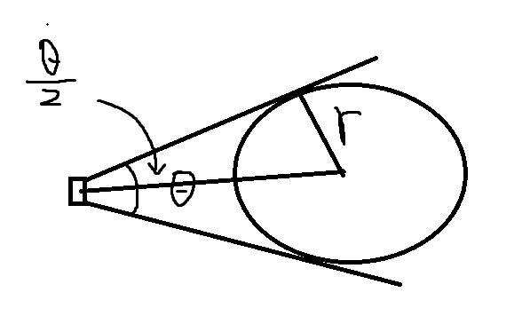

# 概述

只将某个物体缩放至整个屏幕， 十分常见的应用场景，这和相机视野有关，需要分透视相机和正交相机来分别说明。

## 透视相机

首先假定物体被相机视野覆盖，有如下图



首先必须知道物体所在的包围球半径 r, 其次相机角度是已知的，就是 camera.fov, fov 是角度制数据，简单根据三角函数可以得出球心到相机的距离 s。

```
s = r/sin(fov)
```

使用代码来表达就是

```js
const dir = new THREE.Vector3(0, 1, 0); // 方向
const dist = Math.abs(sphere.radius / Math.sin(((fov / 360) * Math.PI) / 2));
const temp = new THREE.Vector3();
temp.addVectors(sphere.getCenter(), dir.multiplyScalar(dist));
```

## 正交相机

正交相机和剖切很相似，除了 position、rotation 外，使用 left、top、right、bottom 来规定视野范围

这个更加容易理解，对于屏幕都是矩形的电脑来说，这个缩放将会恰达好处(精确度高，透视相机因为用到了包围球其实不是很精确)。

```js
const left = -(boundingBox.max.x - boundingBox.min.x) / 2;
const right = (boundingBox.max.x - boundingBox.min.x) / 2;
const top = (boundingBox.max.z - boundingBox.min.z) / 2;
const bottom = -(boundingBox.max.z - boundingBox.min.z) / 2;

const camera = new THREE.OrthographicCamera(left, right, top, bottom, 1, 1000);
camera.lookAt(new THREE.Vector3(0, -100, 0));
```

用途: 制作小地图
